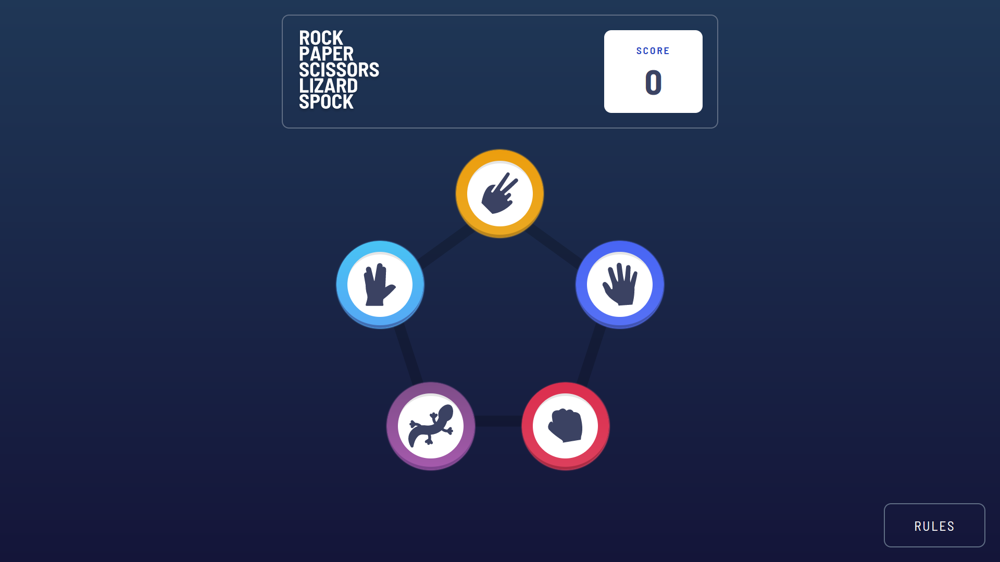

# Rock Paper Scissors Lizard Spock

This website is a rock paper scissors lizard spock game.

## Project Functionality

The user selects one of 5 options, the computer then selects a random option. There are three possible outcomes: the user wins, the computer wins, or a tie. You can check the rules by clicking on the button with the same text on it.

You can visit website by clicking [this link](https://kanae367.github.io/rock-paper-scissors-lizard-spock/)

## Technologies used

- HTML
- CSS
- Js
- Flex
- Adaptive layout

## How to start

Clone the repository using the following command:

`git clone https://github.com/kanae367/rock-paper-scissors-lizard-spock`
